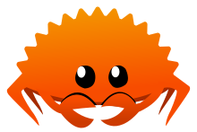

## RustyRustLessons
#### Learn Basics of Rust in Five Lessons Only
It contains all the basics concepts of rust in just five lesson only and you can learn each lesson by changing branch to each lesson.

#### Lesson Included 📖: - 
* [Lesson 1 - Print Vars Types Strings](https://github.com/chaudharypraveen98/RustyRustLessons/tree/Lesson_1_Print_Vars_Types_Strings/src)

* [Lesson 2 - Array Tuples Vectors](https://github.com/chaudharypraveen98/RustyRustLessons/tree/Lesson_2_Array_Tuples_Vectors/src)

* [Lesson 3 - Conditionals Loops](https://github.com/chaudharypraveen98/RustyRustLessons/tree/Lesson_3_Conditionals_Loops/src)

* [Lesson 4 - Functions Pointers References](https://github.com/chaudharypraveen98/RustyRustLessons/tree/Lesson_4_Functions_Pointers_References/src)

* [Lesson 5 - Structs Enums Cli](https://github.com/chaudharypraveen98/RustyRustLessons/tree/Lesson_5_Structs_Enums_Cli/src)

#### Reference Video 🎥
[Rust Crash Course | Rustlang with Brad](https://www.youtube.com/watch?v=zF34dRivLOw)

#### Resources 📘
[Rust Docs](https://www.rust-lang.org/learn)

#### I don't have Rust, Where to get started ? 😕
##### Why not to try [Rust Playground](https://play.rust-lang.org/)